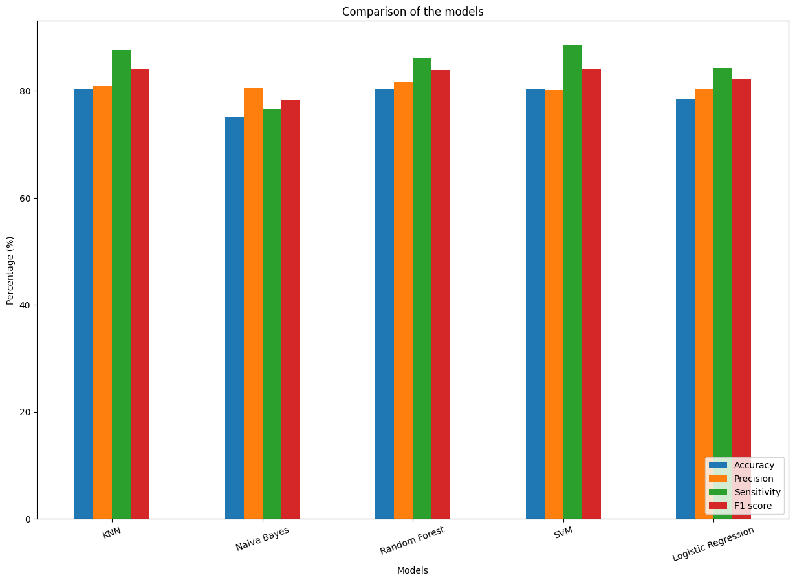
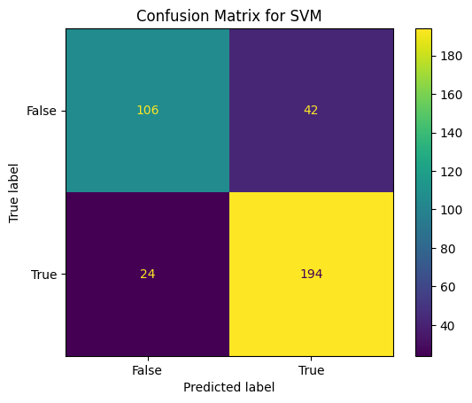
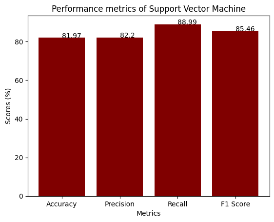

# Heart Disease Prediction using Machine Learning

This project predicts heart disease using multiple machine learning algorithms and compares their performance using 10-fold cross-validation.

## Algorithms Used

- K-Nearest Neighbors (KNN)
- Naive Bayes
- Random Forest
- Support Vector Machine (SVM)
- Logistic Regression

## Features Used

- Age
- Blood Pressure
- Cholesterol
- Chest Pain Type
- ECG Results
- Fasting Blood Sugar
- Exercise Induced Angina

## Evaluation Metrics

- Accuracy
- Precision
- Recall
- F1-score
- ROC-AUC
- Confusion Matrix

## Technologies

- Python
- Pandas
- NumPy
- Scikit-learn
- Matplotlib
- Seaborn

## How to Run

```bash
pip install -r requirements.txt
python heart_disease_prediction.py
```
## Dataset

The dataset used is a processed version of a publicly available heart disease dataset commonly used for machine learning research.

## Results






